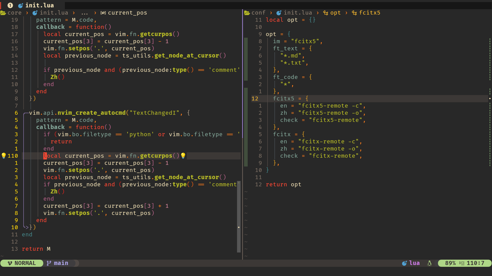

<h1 align="center">
  Neovim Config“
</h1>




### Keyboard Shortcuts

leader = `<space>`

#### 1 Base
| Shortcut           | Action                                 | Mode |
|--------------------|----------------------------------------|------|
| `W`                | save file                              | n    |
| `Q`                | quit file                              | n    |
| `B`                | delete current buffer                  | n    |
| `N`                | :nomal                                 | v    |
| `Y`                | Copy selected text to system clipboard | v    |
| `ca`               | Copy full text to system clipboard     | n    |
| `<leader>sc`       | toggle spell check                     | n    |
| `<leader>sw`       | toggle wrap                            | n    |
| `<leader><cr>`     | nohlsearch                             | n    |
| `<C-n>`            | Escape from terminal input mode        | t    |
| `<leader><leader>` | Goto the next placeholder (<++>)       | n    |

#### 2 Move
| Shortcut    | Action                          | Mode |
|-------------|---------------------------------|------|
| `j`         | gj                              | n    |
| `k`         | gk                              | n    |
| `H`         | Cursor to the start of the line | n    |
| `J`         | Cursor down 10 terminal lines   | n    |
| `K`         | Cursor up 10 terminal lines     | n    |
| `L`         | Cursor to the end of the line   | n    |
| `<C-l>`     | Move Cursor right               | i    |
| `<leader>J` | Flash jump                      | n    |

#### 3 Panes and tmux
| Shortcut | Action                                                                      | Mode |
|----------|-----------------------------------------------------------------------------|------|
| `sh`     | Create a new vertical split screen and place it left to the current window  | n    |
| `sj`     | Create a new split screen and place it below to the current window          | n    |
| `sk`     | Create a new split screen and place it above to the current window          | n    |
| `sl`     | Create a new vertical split screen and place it right to the current window | n    |
| `smv`    | Rotate splits and arrange splits vertically                                 | n    |
| `smh`    | Rotate splits and arrange splits horizontally                               | n    |
| `<C-h>`  | Move cursor one window left                                                 | n    |
| `<C-j>`  | Move cursor one window down                                                 | n    |
| `<C-k>`  | Move cursor one window up                                                   | n    |
| `<C-l>`  | Move cursor one window right                                                | n    |
| `<A-h>`  | Resize pane left                                                            | n    |
| `<A-j>`  | Resize pane top                                                             | n    |
| `<A-k>`  | Resize pane bottom                                                          | n    |
| `<A-l>`  | Resize pane right                                                           | n    |

#### 4 Buffers and tabs
| Shortcut | Action               | Mode |
|----------|----------------------|------|
| `tn`     | Goto next buffer     | n    |
| `tp`     | Goto previous buffer | n    |
| `tt`     | Open file browser    | n    |

#### 5 Edite
| Shortcut     | Action                     | Mode |
|--------------|----------------------------|------|
| `ga`         | Align chars                | n, v |
| `S`          | Add surround chars         | v    |
| `cs`         | Change surround chars      | n    |
| `<leader>ts` | Replace all tab with space | n    |
| `<leader>ss` | Quick substitute           | n, v |

#### 6 Codeing
| Shortcut     | Action               | Mode |
|--------------|----------------------|------|
| `;f`         | Formating code       | n    |
| `<leader>cc` | Comment code visual  | n, v |
| `<Tab>`      | Select next item     | i, s |
| `<S-Tab>`    | Select prev item     | i, s |
| `<CR>`       | Accept selected item | i    |
| `<F5>`       | Code runing          | n    |

##### 6.1 Lsp
| Shortcut     | Action                                     | Mode |
|--------------|--------------------------------------------|------|
| `<leader>pd` | Peek definition with lspsaga               | n    |
| `<C-o>`      | Edit selected definition                   | n    |
| `<C-v>`      | Vsplit and edit selected definition        | n    |
| `<leader>pr` | Peek references with telescope             | n    |
| `<C-k>`      | Show hover doc with lspsaga                | n    |
| `<leader>wa` | Add workspace folder                       | n    |
| `<leader>wr` | Remove workspace folder                    | n    |
| `<leader>wl` | List workspace folders                     | n    |
| `<leader>rn` | Rename selected variable name with lspsaga | n    |
| `<leader>ca` | Show code action with lspsaga              | n    |
| `<leader>ot` | Open outline with lspsaga                  | n    |
| `<leader>d[` | Goto diangostics prev                      | n    |
| `<leader>d]` | Goto diangostics next                      | n    |

##### 6.2 Competitest
| Shortcut | Action                     | Mode |
|----------|----------------------------|------|
| `:CP`    | Open competitest mode      | c    |
| `;rr`    | Running testcase           | n    |
| `;ra`    | Add testcase               | n    |
| `;re`    | Edit testcase              | n    |
| `;ri`    | Open competitive companion | n    |
| `;rd`    | Delete testcase            | n    |
| `;rm`    | Remove all testcase        | n    |

#### 7 File Explorer
##### 7.1 Ranger
| Shortcut     | Action                     | Mode |
|--------------|----------------------------|------|
| `<leader>ra` | Edit file                  | n    |
| `<leader>rh` | Split left and edit file   | n    |
| `<leader>rj` | Split bottom and edit file | n    |
| `<leader>rk` | Split top and edit file    | n    |
| `<leader>rl` | Split right and edit file  | n    |

##### 7.2 Telescope
| Shortcut     | Action                                | Mode |
|--------------|---------------------------------------|------|
| `<leader>ff` | Fuzzy search files with filename      | n    |
| `<leader>fw` | Fuzzy search files with  file content | n    |


### Install
```shell
python-pynvim
bash-language-server
clang
vscode-json-languageserver
vscode-css-languageserver
vscode-html-languageserver
typescript-language-server
lua-language-server
jedi-language-server
vim-language-server
python-black
yarn
fd
ripgrep
```


---

### License MIT
